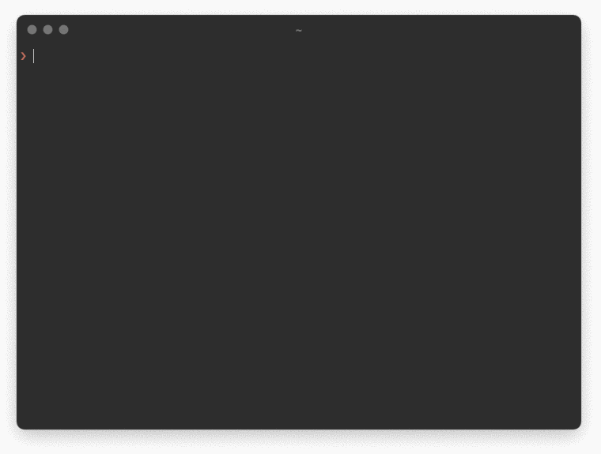

# csv2actual

A command line utility to import bank transactions as csv into [Actual](https://actualbudget.com/).



## Why?

Although [Actual](https://actualbudget.com/) supports importing bank statements from csv files, the exported format, as it is provided by the banks, sometimes needs to be adjusted manually. This utility aims to enable importing data from various banks, so there's no need to enter the statements by hand or change the exported csv files. Instead, the fields are mapped and parsed automatically.

## Supported Banks

| Bank | Country | Export Language |
| ---- | ------- | --------------- |
| [Belfius](https://www.belfius.be/) | Belgium | be |
| [neon](https://www.neon-free.ch/) | Switzerland | en |
| [Sparkasse](https://www.sparkasse.de/) | Germany | de |
| [Zürcher Kantonalbank](https://www.zkb.ch/) | Switzerland | de |

If you'd like to see support for another institution, please open an issue or PR 💫
Please consider adding a dummy export to `tests/dummy-data`, so the import could be included in a test.

## Getting Started

Install as global package through npm:

```bash
npm install -g @jorisnoo/csv2actual
# OR
yarn global add @jorisnoo/csv2actual
```

To import transactions from a file, run:

```bash
csv2actual filename.csv
```

You will be prompted to enter your buget and choose an account to import into.

## Local Development

If you'd like to tinker with the code, you may use a local copy of this repository: 

```bash
git clone git@github.com:jorisnoo/csv2actual.git
cd csv2actual

npm install # or: yarn install

# Make the command available globally
npm link # or: yarn link
```
